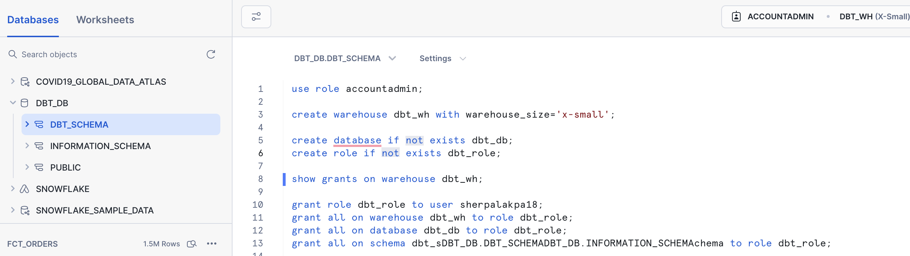
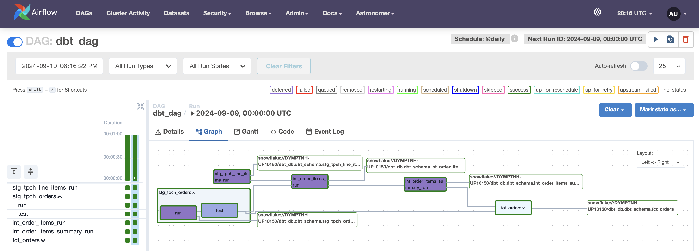
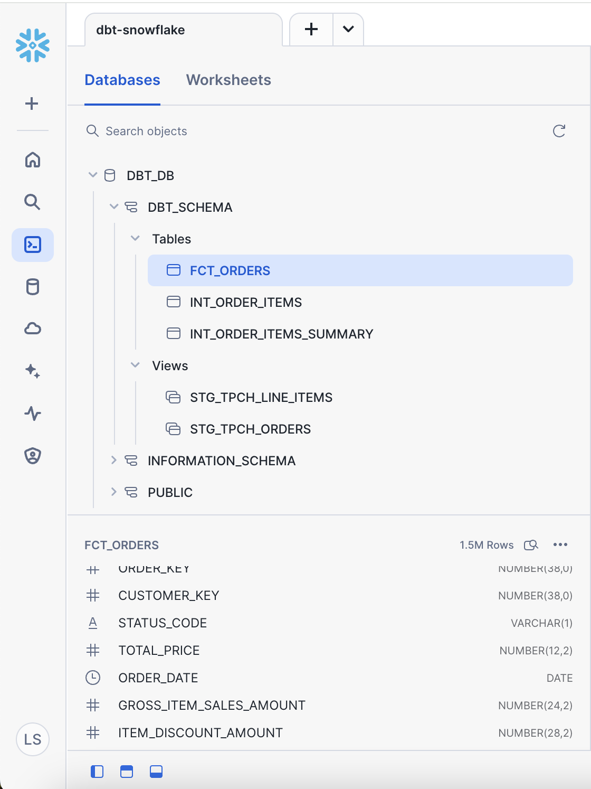

# ELT Pipeline with DBT, Snowflake, and Airflow

## Project Overview

This project demonstrates how to build an ELT (Extract, Load, Transform) pipeline from scratch using DBT, Snowflake, and Airflow. The pipeline extracts data from Snowflake’s TPCH dataset, transforms it using DBT models, and orchestrates the workflow using Airflow. This project follows a modular approach to data modeling, applying various transformations and tests to ensure data quality before storing it in a data warehouse.

## Features

- **DBT**: Used for data transformations and modeling (fact tables, data marts) using Snowflake as the target warehouse.
- **Snowflake**: Data warehouse platform where the TPCH dataset is loaded and transformations are executed.
- **Airflow**: For orchestration and scheduling of DBT jobs in a scalable and maintainable way.
- **Dimensional Modeling**: Implementing best practices in data warehousing, creating fact and dimension tables.
- **Testing**: Applying both singular and generic tests using DBT to ensure data integrity.
- **Macros**: Custom reusable DBT macros for business logic (e.g., generating surrogate keys, handling discounts).

## Requirements

To run this project locally, you will need the following tools installed:

- **Python 3.x**
- **DBT Core**: For data modeling and transformation
- **Snowflake**: Ensure you have a Snowflake account
- **Airflow**: For orchestration
- **Astronomer Cosmos**: To help run DBT tasks within Airflow

### Install DBT

```bash
pip install dbt-core
pip install dbt-snowflake
```
### Install Airflow and Astronomer Cosmos
```bash
brew install astro
```

## Setup Snowflake
Ensure you have an active Snowflake account and configure your environment accordingly.

### Project Setup

### 1. Snowflake Environment Setup
In Snowflake, create the following resources:
- Warehouse: dbt_wh
- Database: dbt_db
- Schema: dbt_schema
- Role: dbt_role

Ensure that your role has the necessary permissions to use the warehouse and the database.

```sql
-- create accounts
use role accountadmin;

create warehouse dbt_wh with warehouse_size='x-small';
create database if not exists dbt_db;
create role if not exists dbt_role;

show grants on warehouse dbt_wh;

grant role dbt_role to user jayzern;
grant usage on warehouse dbt_wh to role dbt_role;
grant all on database dbt_db to role dbt_role;

use role dbt_role;

create schema if not exists dbt_db.dbt_schema;
```

#### 2. Initialize DBT Project

```sh
dbt init <your_project_name>
```
Set up your Snowflake profile in the profiles.yml file, pointing it to the Snowflake environment you created.


#### 3. Data Modeling
- Staging Models: These models are created by pulling data from Snowflake's TPCH dataset using DBT's source functionality.
- Fact Tables: Aggregate data is modeled as fact tables.
- Macros: A custom macro is written to calculate discounted prices.
```sql
-- Example of a staging table
select
    o_orderkey as order_key,
    o_custkey as customer_key,
    o_orderstatus as status_code,
    o_totalprice as total_price,
    o_orderdate as order_date
from
    {{ source('tpch', 'orders') }}

```

#### 4. Testing
- Generic Tests: Ensure keys are unique and non-null.
- Singular Tests: Write custom SQL queries for more specific tests, such as checking that discounts are valid.

#### 5. Orchestration with Airflow
Create an Airflow DAG to orchestrate the DBT runs. Use Astronomer Cosmos to execute DBT models within Airflow.

```python
dbt_snowflake_dag = DbtDag(
    project_config=ProjectConfig("/usr/local/airflow/dags/dbt/data_pipeline",),
    operator_args={"install_deps": True},
    profile_config=profile_config,
    execution_config=ExecutionConfig(dbt_executable_path=f"{os.environ['AIRFLOW_HOME']}/dbt_venv/bin/dbt",),
    schedule_interval="@daily",
    start_date=datetime(2023, 9, 10),
    catchup=False,
    dag_id="dbt_dag",
)
```

## Running the Pipeline

1. Start Airflow:
    ```bash
    astro dev start
    ```

2. Run the DAG:
    Access the Airflow UI at http://localhost:8080, and trigger the dbt_pipeline DAG to run the ELT process.


## Conclusion
This project provides a step-by-step guide on how to build an ELT pipeline using DBT, Snowflake, and Airflow. The pipeline leverages DBT for transformations, Snowflake as a data warehouse, and Airflow for orchestration. It also includes testing for data integrity and reusable macros to streamline transformation logic.


